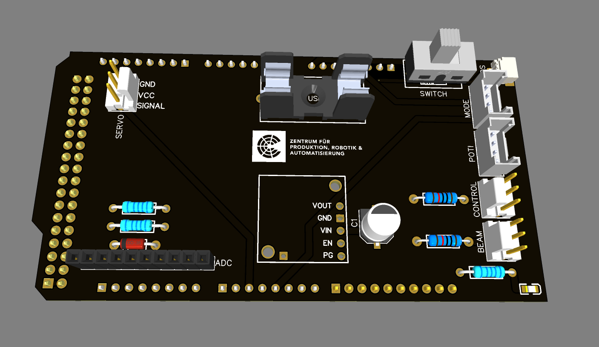
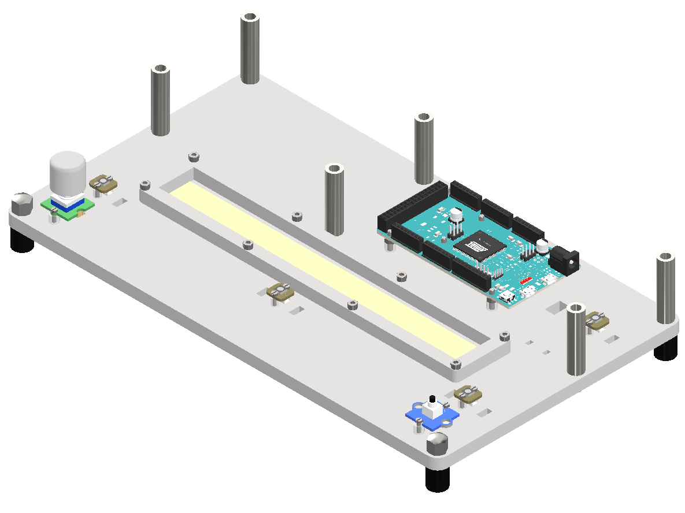

# Equip the Base Plate

The base plate serves as the structural and electronic foundation of the Ball-on-Beam platform. It supports the Arduino board, custom shield, sensors, and user interface elements.

## Step-by-Step Instructions

1. **Mount the rubber feet**
    - Attach all four rubber feet to the corners of the base plate.
    - Secure the two on the bottom side with the M4 provided cap nuts.
    - Secure the two on the top side with the round 40mm long spacers.
    - Ensure they are securely fastened to provide stability.

    

    
Rubber Foot (3D model)

2. **Attach the other 4 spacers**
    - Use the remaining 4 round 40mm long spacers and secure them with the provided M4 Screws.
    - These will later elevate the top plate and provide clearance for the Arduino and the servo.

3. **Install the SoftPot sensor**
    - Pull off the protective film of the double-sided tape from the SoftPot sensor.
    - Align it with the designated area on the base plate.
    - Press it down firmly to ensure good adhesion.
    - Srew down the frame around the SoftPot sensor using 8 of the provided M3 screws and nuts.

    

    
SoftPot Sensor

4. **Srew down the Arduino Due and Shield**
    - Place the Arduino Due on the base plate.
    - Use the provided M3 screws to secure the Arduino Due to the base plate.
    - Place the shield on top of the Arduino.

    

    
Arduino Shield (3D model)

5. **Equip the base plate with the control interface**
    - Place the 4 NeoPixel modules in the designated cutouts and use the provided screws and spacers to secure them in place.
    - Place the pushbutton in the designated cutout and secure it with the provided screws and spacers.
    - Attach the rotary angle sensor to the base plate using the provided M3 screws and spacers.

---

Base Plate with mounted components (3D model)
