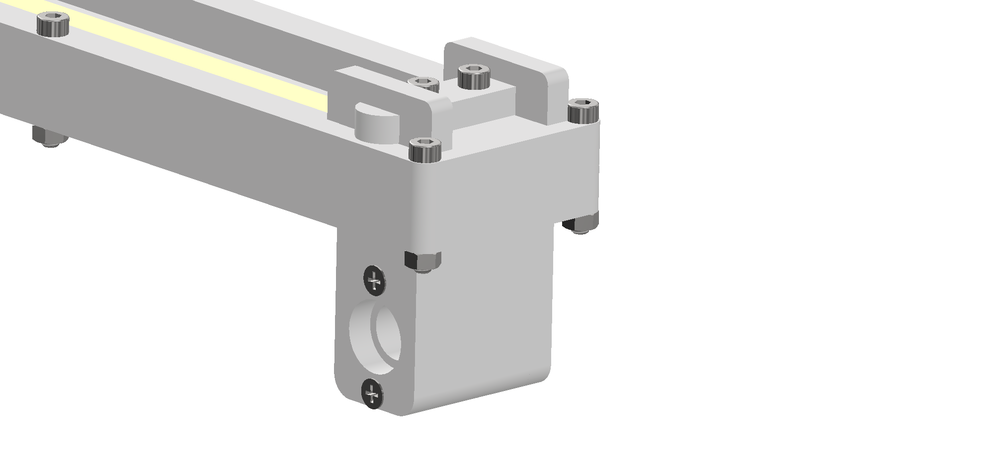
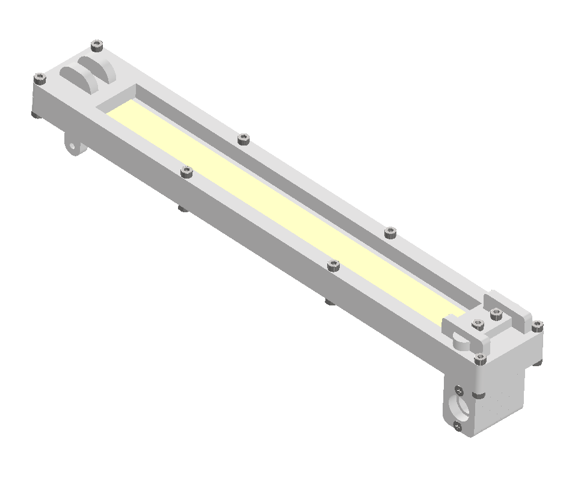

# Preparing the Beam

The beam serves as the dynamic element of the Ball-on-Beam platform. It holds the SoftPot position sensor and connects the servo motion to the beam’s rotation. The following steps describe the full assembly process.

## Step-by-Step Instructions

1. **Attach the SoftPot Sensor**
    - Place the SoftPot sensor on the dedicated recessed area of the main beam plate.
    - Peel off the protective film from the double-sided adhesive and press the sensor down firmly.
    - Place the mounting frame over the sensor.
    - Secure the frame with 8 M3 screws and locknuts.

    
    
SoftPot mounted on beam (3D model)

2. **Connect the Servo Linkage**
    - Insert the servo linkage parts into the dedicated side slots on the beam.
    - Place a spacer between the linkage parts to align the hole.
    - Insert the M3 screw through the hole and secure it with a standard nut.
    - Ensure the linkage is firmly fastened.

    
    
Servo linkage connection (3D model)

3. **Prepare the Opposite Side**
    - Slide the bearing mounting parts into the corresponding slots.
    - Insert the top bracket between the outer sides. 
    - Insert two M3 nuts into the dedicated hexagonal recesses on the opposite end of the beam and fasten the top bracket with two M3 screws.

4. **Add Spacers and Countersunk Screws**
    - Place the two lower spacers underneath the beam structure.
    - Insert two countersunk screws from the bottom and tighten them into the nuts from step 3.
    - Verify alignment of the beam structure and ensure mechanical stiffness.

    
    
Beam structure with bearing mount (3D model)

---
Once all elements—including the SoftPot sensor, servo linkage, and bearing mounts—are securely assembled, the beam is ready for integration. The fully assembled structure should look like the model shown below.

Fully assembled beam (3D model)

