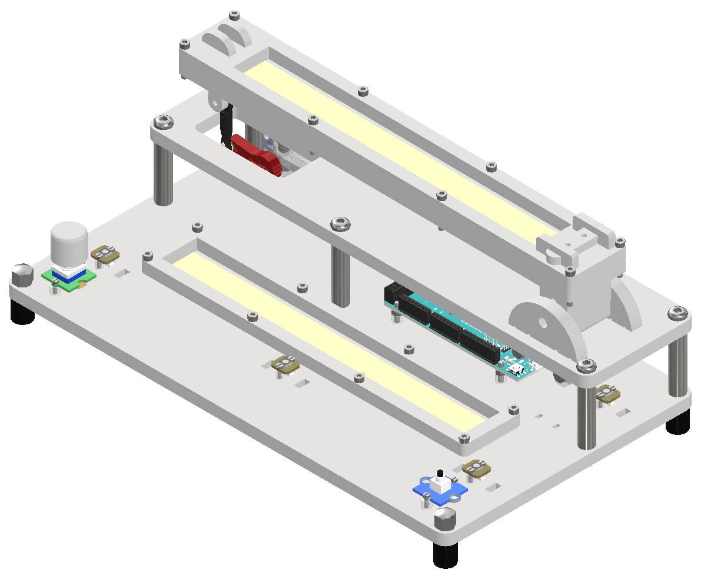

# Final Assembly

In this step, all subsystems are brought together to form the complete Ball-on-Beam platform.

## Step-by-Step Instructions

1. **Stack the top plate on the base**
   - Align the vertical spacers and screw the top plate onto the base.

2. **Mount the beam into the bearings**
   - Slide the beam shafts into the bearings from the side.
   - Check for smooth rotation and adjust if necessary.

3. **Install the servo motor**
   - Align the servo horn with the beam adapter and fasten it securely.

4. **Cable management**
   - Route all wires through the slots in the base plate.
   - Use cable ties or adhesive clips to secure them.

5. **Final inspection**
   - Test the mechanical freedom of the beam.
   - Check sensor and power connections before applying voltage.

---

Fully Assembled Ball-on-Beam System (3D model)

