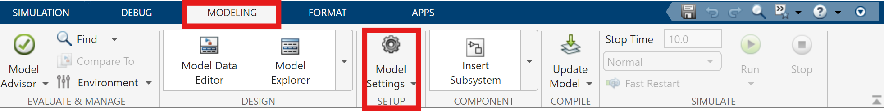

# Simulink Setup

This section explains how to set up the Simulink environment to work with the Ball-on-Beam platform. It includes instructions for loading the custom block library, preparing your workspace, and understanding the main components required to build your own control model.

---

## 1. Load the Custom Block Library

The Ball-on-Beam platform uses a custom Simulink block library that contains pre-configured blocks for sensors, actuators, and control logic.

- Open MATLAB.
- Add the `Custom_Library/` folder permanently to your MATLAB path by running the following command:

```matlab
addpath('path/to/your/ball-on-beam-docs/Simulink/Custom_Library');
savepath;
```
- Now you can find the custom Ball-on-Beam Library in your Simulink library browser.


<center>Custom Simulink library containing Ball-on-Beam-specific blocks</center>

---

## 2. Explore the Available Blocks

The library includes blocks for:

- **Sensor Input** (e.g. SoftPot, rotary knob)
- **Actuator Output** (e.g. Servo Motor)
- **User Interface** (e.g. NeoPixel, Button)

Each block is configured for real-time deployment using Embedded Coder and is compatible with the Arduino Due.

---

## 3. Configure Hardware in Simulink

Before generating code or uploading to the Arduino Due, you must configure the Simulink model for the correct hardware platform.

Follow these steps to select the Arduino Due as target hardware:

1. Open a new empty Simulink model.
2. Click on the **"Model Settings"** button (or use `Ctrl+E`).
3. In the **Configuration Parameters** window, go to **"Hardware Implementation"**.
4. Under **"Hardware board"**, select `Arduino Due` from the dropdown list.
5. Apply all settings and close the window.

> This configuration ensures that code generation and deployment are set up correctly for the Arduino Due.

---


<center>Access the Model Settings via the toolbar or Ctrl+E</center>


<center>Model Configuration Parameters window</center>


<center>Hardware Implementation tab with Arduino Due selected</center>

---

Once the hardware is correctly configured, you can proceed with initial testing and troubleshooting to ensure the system operates as expected before starting with the course tasks.