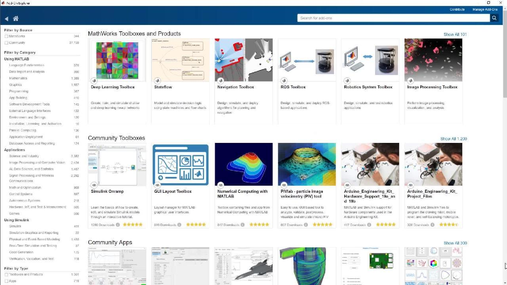

# Required Tools

Before setting up the software environment for the Ball-on-Beam platform, make sure all required tools and packages are installed correctly. This section guides you through the installation of MATLAB, Simulink, and the required toolbox.

---

## 1. MATLAB Installation

The platform requires MATLAB as the base environment for all model-based development and code generation tasks.

- **Minimum required version**: MATLAB R2024a
- Obtain MATLAB from the official website:  
  [🔗 MATLAB Installation Guide](https://www.mathworks.com/help/install/install-products.html)

> If you're a student, you can use your university license to activate MATLAB.

---

## 2. Simulink Installation

Simulink must be installed alongside MATLAB. It provides the graphical modeling environment used for system design and simulation.

- Make sure to select **Simulink** during MATLAB installation, or install it later via the Add-On Explorer.

- **Installation Steps**:
    1. Open MATLAB.
    2. Go to the **Home** tab and click on **Add-Ons** > **Get Add-Ons**.
    3. Search for "Simulink" and select it.
    4. Click on the package and follow the installation instructions.

Installing Simulink through the Add-On Explorer

---

## 3. Toolbox Installation

The following toolbox is required to build, simulate, and deploy the model to the Arduino hardware:

[🔗 Simulink Support Package for Arduino Hardware](https://de.mathworks.com/matlabcentral/fileexchange/40312-simulink-support-package-for-arduino-hardware)

- **Installation Steps**:
    1. Open MATLAB.
    2. Go to the **Home** tab and click on **Add-Ons** > **Get Add-Ons**.
    3. Search for "Simulink Support Package for Arduino Hardware".
    4. Click on the package and follow the installation instructions.

> All toolboxes can be installed using the Add-On Explorer in MATLAB.

MATLAB Add-On Explorer

---

## 4. GitHub Repository

The custom Simulink block library and all documentation are available in the official GitHub repository:

- Github Repository: [🔗 sebamci/ball-on-beam-course](https://github.com/sebamci/ball-on-beam-docs)

You can find the block library under the `Simulink/Custom_Library` directory. Clone or download the repository to your local machine to access the files.

> **Note:** The repository contains only the block library and documentation.  
> The main Simulink model is not included and must be built locally by following the tasks and instructions provided throughout this course.