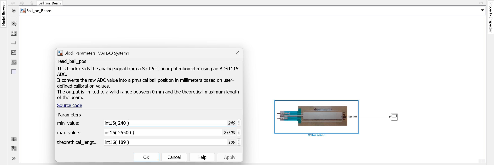

# I. Read Ball Position

This task introduces the SoftPot linear position sensor as the primary input for detecting the ball’s position on the beam. You will learn how to connect it, read its analog values in Simulink, calibrate its range, and visualize the measurement.

---

## 1. Connect and Initialize

- The Beam SoftPot sensor is connected to the `Beam` Molex KK input of the Arduino shield via the provided cable.
- In Simulink, open your model and drag the `Calib_Beam_SoftPot` block from the custom library into your diagram.
- Connect the output of the `Calib_Beam_SoftPot` block to a `Display` block to monitor the raw analog values.

> Make sure the sensor is properly fixed on the beam and aligned with the ball path.

Calib_Beam_SoftPot block connected to Display for calibration

---

## 2. Calibration

- Move the ball to the **far left** of the beam and note the raw ADC value shown in the `Display`.
- Then move the ball to the **far right** and record that value as well.
- These two values define the sensor's minimum and maximum.
- Drag the `Beam_SoftPot` block from the custom library into your model.
- Double click the `Beam_SoftPot` block to set and apply these values as calibration parameters.
- Connect the output of the `Beam_SoftPot` block to a `Scope`.

> The output of the calibration block is now a normalized position signal in millimeters.

Calibrated SoftPot block connected to Scope

---

## 3. Run Your First BoB Model

Now that the SoftPot is calibrated and integrated into your model, it's time to run your first simulation on the hardware.

Follow these steps:

1. Ensure that the Arduino Due is connected via the **programming USB port**.
2. Verify that the model is correctly configured for hardware deployment (see the previous setup chapters).
3. Click on `Monitor & Tune` in the Simulink `HARDWARE` tab.
4. After successful deployment, observe the Scope or Display block output while manually moving the ball across the beam.

> This test confirms that Simulink is communicating correctly with the hardware and that the SoftPot is providing meaningful, real-time data.

Scope of Ball tracked by the SoftPot in real-time

---

## 4. Test and Validate

- Move the ball slowly across the beam and verify that the Scope signal reacts smoothly and proportionally.
- The full range should approximately match the physical length of the beam (0 mm to 189 mm).
- Look out for:
    - Non-linearity

> Note: The discontinuities in the graph occur when the ball reaches the edge of the beam and temporarily loses contact with the SoftPot sensor.

---

## 5. Summary

| Step             | Action                                                     |
|------------------|------------------------------------------------------------|
| Hardware         | Control SoftPot must be connected via RLU 3-pin cable      |
| Calibration      | Use `Calib_Beam_SoftPot` block from custom library         |
| Simulink Block   | Use `Read_Ball_Position` block from custom library         |
| Visualization    | Scope block or display block for real-time feedback        |

Once this task is complete, you have a reliable analog input for ball position and can proceed with servo integration in the next task.
