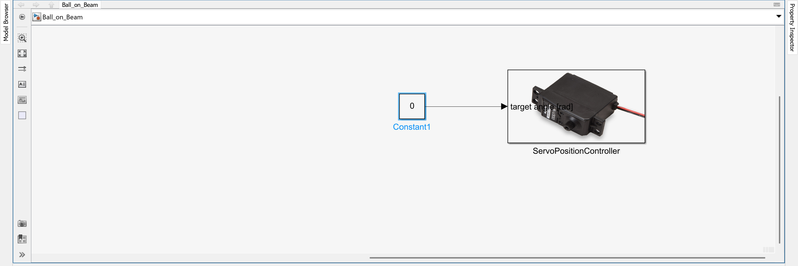
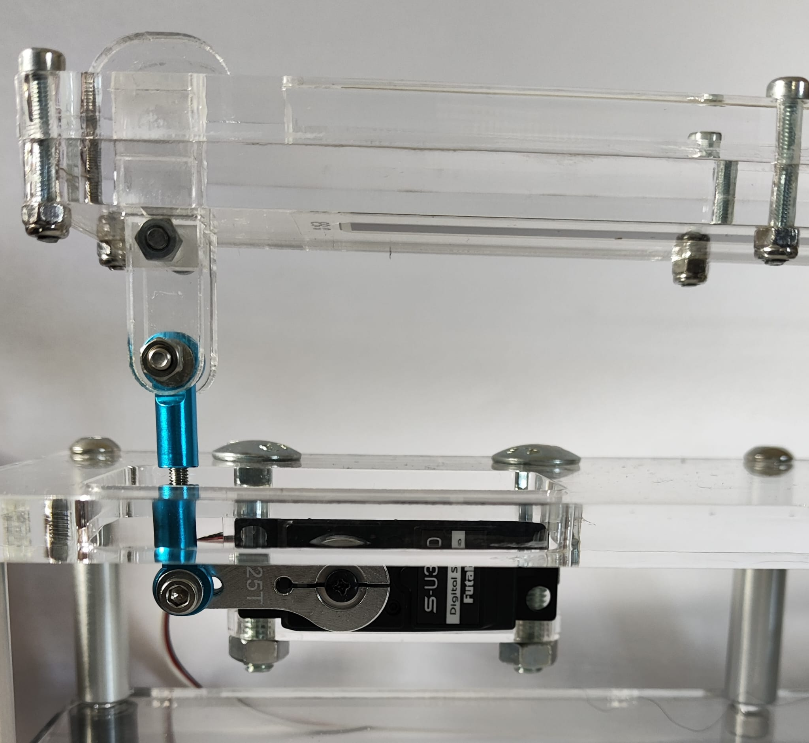
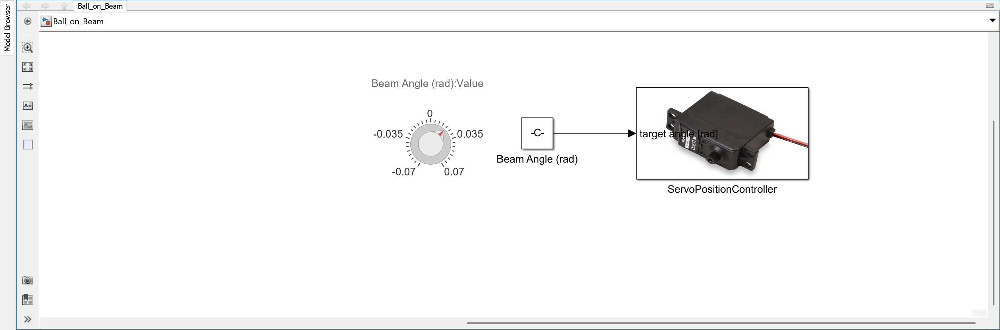

# II. Control the Beam

This task introduces the servo motor that adjusts the beam angle. You will learn how to integrate the motor in Simulink, send control signals, and calibrate the the neutral position to ensure precise beam movement.

---

## 1. Connect and Initialize

- The servo motor is connected to the designated `SERVO` Molex KK output on the Arduino shield:
    - **Red wire**: VCC (R)
    - **Black wire**: GND (B)
    - **White wire**: Signal (W)
- In Simulink, open your model and drag the `ServoPositionController` block from the custom library into your diagram.
- Connect the input of the block to a `Constant` block (0 for center position) or a `Slider Gain` block for interactive testing.

> Make sure the servo is securely mounted and not mechanically blocked.

Servo block connected to a constant input

---

## 2. Calibrate Neutral Position 

The servo needs to be centered so the beam is in a horizontal position when the input signal is at 0 rad.

- Use a `Constant` block with a value of `0` connected to the `ServoPositionController` block.
- Deploy the model using `Monitor & Tune`.
- Manually adjust the servo horn and the two rod ends until the beam is perfectly parallel to the top plate.
- Tighten the servo horn screw carefully after alignment.

> ⚠️ The input of the `ServoPositionController` block directly represents the desired beam angle in **radians**.  
> For example, `0` corresponds to a level beam, while positive or negative values tilt the beam accordingly.  
> This definition is important for the later implementation of the feedback controller.

Servo horn mounted at neutral (0°) beam angle

---

## 3. Test Range of Motion

- Now adda `Knob`block to your model and connect it to the `Constant` to control the servo position dynamically.
- Set the knob range to `[-0.07, 0.07]` to cover the full range of motion.
- Deploy the model and turn the knob to observe the servo movement.

Testing servo response with dynamic input

---

## 4. Summary

| Step             | Action                                                    |
|------------------|-----------------------------------------------------------|
| Hardware         | Servo connected correctly to shield servo output          |
| Simulink Block   | Use `ServoPositionController` from custom library       |
| Calibration      | Adjust horn for horizontal beam at 0° input               |
| Input Signal     | Start with constant 0°, then test with dynamic sources    |
| Testing          | Verify full movement range and smooth motion              |

Once the servo responds correctly and the beam moves reliably, you're ready to proceed with manual control using the rotary knob.
