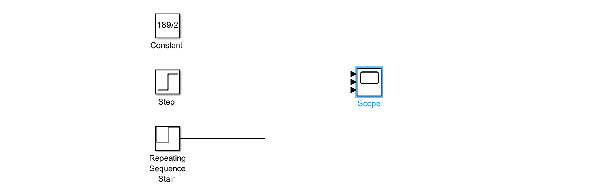
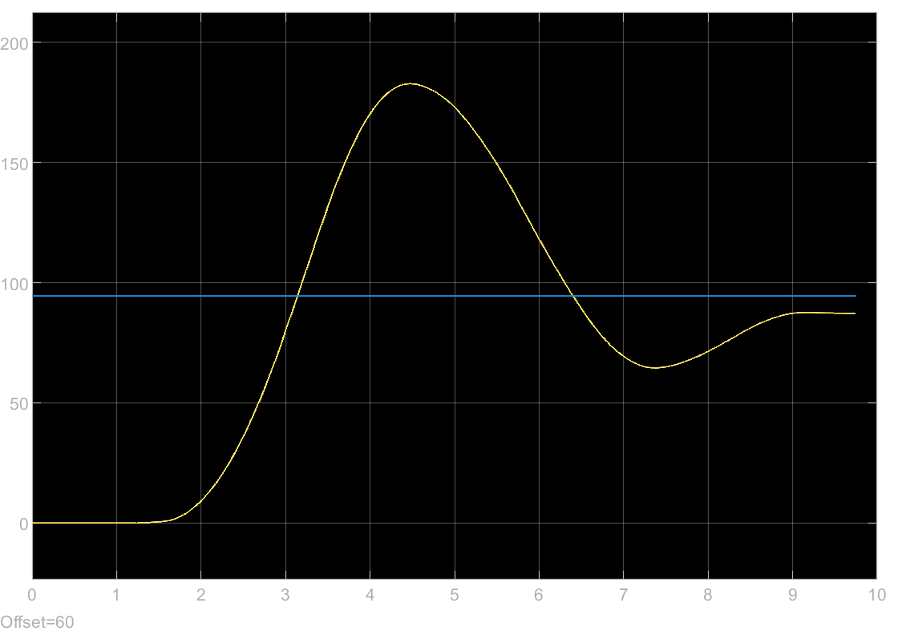

# IV. Generate Setpoints

In this task, you will learn how to generate setpoints for the target position of the ball on the beam. These reference values are essential for later automatic control and allow you to simulate different motion profiles. You will also manually try to follow the setpoints using the rotary knob from the previous task.

---

## 1. Add Setpoint Block

- In Simulink there are different ways to generate setpoints:
  - `Constant` setpoint (e.g. 100 mm)
  - `Step` change (e.g. from 50 mm to 150 mm)
  - `Repeating Sequence Stair` for periodic motion

> These setpoints represent the **desired ball position** in millimeters.

Different blocks that can be used as Setpoints

---

## 2. Visualize the Setpoint

- Connect the output of the `Setpoint_Generator` block to the same `Scope` as the `Read_Ball_Position` Block.
- Run the model using `Monitor & Tune`.
- Verify that the generated setpoint signal behaves as expected (e.g. changes smoothly or switches at a defined time).

Example setpoint signal displayed in Scope

---

## 3. Try to Follow the Setpoint Manually

- Display the **ball position** (from `Read_Ball_Position`) and the **setpoint** on the same Scope.
- Try to move the knob in a way that makes the ball position track the setpoint.
- You can start with something simple like a constant setpoint or a step change, and then try more complex waveforms.
- Safe this model in a new Simulink file (e.g. `Manual_Tracking.slx`) for later use.

> This task demonstrates how difficult it is to manually follow even a simple trajectory.  
> It provides an intuitive motivation for the next step: automatic PID control.

Manual attempt to follow a generated setpoint

---

## 4. Summary

| Step             | Action                                                              |
|------------------|---------------------------------------------------------------------|
| Block            | Use `Setpoint_Generator` from custom library                        |
| Output Signal    | Target ball position in millimeters                                 |
| Use Case         | Combine with manual control and compare real vs. desired position   |
| Goal             | Understand the need for closed-loop feedback                        |

Next, you will integrate the second SoftPot to dynamically control the setpoint during operation.
