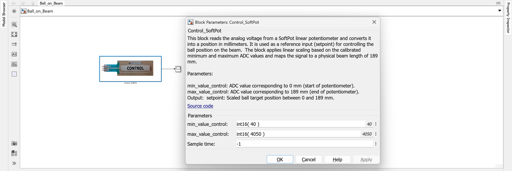

# Adjust Target with SoftPot

In this task, you will replace the fixed setpoint from Simulink with a second SoftPot sensor. This Control SoftPot allows the user to define the desired ball position interactively by physically sliding a ball along the sensor. The setpoint becomes dynamic and analog – ideal for testing real-time system behavior.

---

## 1. Extend the Model

Continue working with your existing model. Replace the Simulin setpoint block used with the `Control_SoftPot` block from the custom library:

- The `Control_SoftPot` block reads the analog signal from the dedicated SoftPot and it can be used as a setpoint source.
- Its output is the desired ball position in millimeters (same format as the previous setpoints).
- Connect the output to the Scope, that was previously used to visualize the setpoint and ball position.

> This change makes your system respond to real-time user input from the physical slider.

Control SoftPot replacing the previous setpoint generator

---

## 2. Connect and Initialize

- The Control SoftPot is connected to the `Control` Molex KK input on the Arduino shield.
- In Simulink, double-click the `Control_SoftPot` block to enter the calibrated ADC min/max values.
- These values can be measured similarly to the Beam SoftPot in the first task (move the ball to both ends and note the ADC values in Scope using the `Calib_Control_SoftPot`).

> Hint: You can use a new Simulink model with just the `Calib_Control_SoftPot` block to easily measure these values.

Calibration of Control SoftPot via Scope

---

## 3. Live Testing

- Deploy the updated model using `Monitor & Tune`.
- Move the ball along the Control SoftPot.
- Observe the resulting setpoint change in real time in the Scope.
- You should now be able to manually command a new desired ball position at any time.

> This setup simulates user interaction in a real control system and prepares the architecture for PID integration.

---

## 4. Try to Follow the new Setpoint with the Rotary Knob

- Use the rotary knob as before, but now the setpoint is dynamic.
- If the ball on the control Softpot is moving it is almost impossible to follow the setpoint manually with the rotary knob.

> This illustrates again the challenge of manual control and motivates the need for automatic feedback control.

---

## 5. Summary

| Step             | Action                                                             |
|------------------|--------------------------------------------------------------------|
| Hardware         | Control SoftPot connected to `Control` Molex input                 |
| Initialize   | Use `Calib_ Control_SoftPot` from custom library to get min-/max-values                      |
| Simulink Block   | Use `Control_SoftPot` block from custom library                    |
| Output Signal    | Dynamic setpoint (ball position in mm)                             |
| Test Goal        | Observe setpoint change in Scope while moving the ball           |

Once you're confident with real-time setpoint adjustment, you're ready to implement the automatic PID controller.
