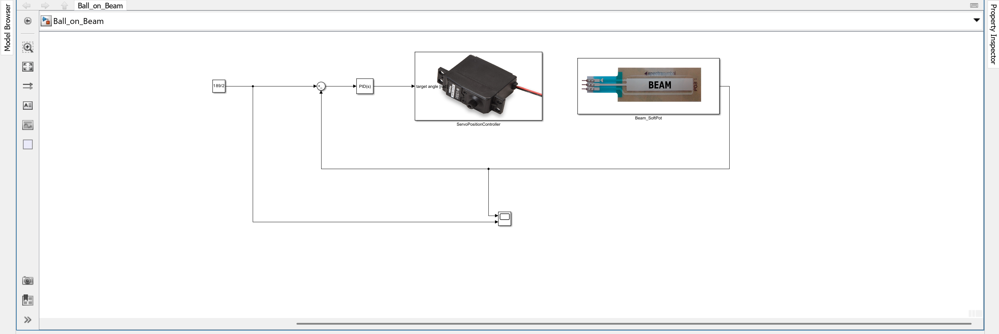

# VI. Basic PID Control

In this task, you will add a PID controller to your model. The controller automatically adjusts the beam angle to minimize the difference between the desired setpoint (e.g. from the Control SoftPot) and the actual ball position (from the Beam SoftPot).

---

## 1. Add the PID Controller Block

Continue working in your existing model and add the following components:

- Drag the `PID Controller` block from the Simulink library into your model.
- Connect the setpoint signal (from `Control_SoftPot`) to the positive input of a `Sum` block.
- Connect the ball position signal (from `Read_Ball_Position`) to the negative input of the same `Sum` block.
- The error signal (setpoint − position) goes into the `PID Controller` block.
- Connect the PID output to the `Servo_Position_Controller`.
- Connect the output of the `Read_Ball_Position` block and your setpoint to a `Scope` to visualize the actual position.

> You now have a full closed-loop control system for automatic ball balancing.

Closed-loop control with PID controller

---

## 2. Initial PID Parameters

Use the following starting values for the PID controller:

| Parameter | Value   |
|-----------|---------|
| P         | 0.0004  |
| I         | 0.00045 |
| D         | 0.00007 |
| N         | 10.00   |

- Double-click the `PID Controller` block to enter these values.
- These parameters are suitable for initial testing and allow you to observe the system response.

---

## 3. Deploy and Observe

- Run the model using `Monitor & Tune`.
- Use different setpoints to observe how the system reacts to setpoint changes.
- The PID controller adjusts the beam angle to bring the actual ball to the desired position.

> Watch out for overshooting, oscillations, or slow convergence – all of these can be improved later during fine-tuning.

Real-time tracking of setpoint and actual ball position with basic PID

---

## 4. Summary

| Step             | Action                                                                |
|------------------|-----------------------------------------------------------------------|
| Controller       | Use `PID Controller` from Simulink library                            |
| Input            | Error signal: setpoint – ball position                                |
| Output           | Beam angle command (radians) to `Servo_Position_Controller`           |
| Goal             | Stabilize the ball at a moving setpoint                               |

With this setup, you’ve built your first functional feedback control loop!  
In the next task, you will improve the controller performance through systematic PID tuning.
