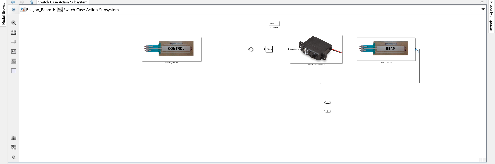
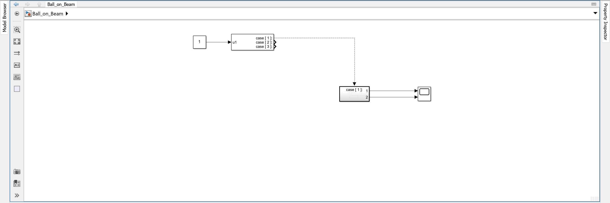

# VIII. Track Ball with SoftPot

In this task, you will build a dedicated subsystem that uses the Control SoftPot as a dynamic reference input. The goal is to regulate the main ball on the beam to the same position as a second ball placed on the Control SoftPot. This demonstrates real-time multi-sensor feedback using your tuned PID controller.

---

## 1. Objective

You will create a **modular subsystem** that contains all components required to:

- Read the Control SoftPot (reference ball position)
- Read the Beam SoftPot (actual ball position)
- Calculate the position error
- Apply PID control
- Command the beam angle via the servo

> This structure prepares your system for advanced tracking and improves reusability and readability.

---

## 2. Build the Subsystem

Inside your Simulink model:

1. Create a new `Switch Case Action Subsystem` and name it as you wish (e.g., `SoftPot_Tracking`).
2. Insert the following blocks into the subsystem:
    - `Control_SoftPot` – reads the setpoint position
    - `Beam_SoftPot` – reads the actual ball position
    - `Sum` block – computes error: (setpoint − position)
    - `PID_Controller_Tuned` – your tuned PID block
    - `Servo_Position_Controller` – sends control signal to the servo
    - Outputs: connect the signals from `Control_SoftPot` and `Beam_SoftPot` to two `Output` blocks for visualization in a Scope outside the subsystem
    - Connect the blocks as in chapter VI, "Basic PID Control", but now use the `Control_SoftPot` as the setpoint source.

>Note: You can just copy and paste the structure from your previous PID model and adapt it to use the SoftPot blocks.

Dedicated subsystem for tracking a second ball using Control SoftPot

---

## 3. Connect the Subsystem

- Place the new subsystem into your **main model**
- Connect the two output blocks to a `Scope` to visualize the setpoint and actual position.
- Connect the subsystem `Action Port` to a `Switch Case` block.
- Configure the `Switch Case` with three different cases **{1,2, 3}**. This will be needed for future tasks where you might want to switch between different control modes.
- Connect a `Constant` block to the `Switch Case` input to select the case (e.g. set it to 1 for now).

> Make sure the analog values from both SoftPots are correctly calibrated and mapped to millimeters.

Subsystem connected in the main model with Switch Case

---

## 4. Run and Test

1. Deploy the model using `Monitor & Tune`
2. Place the **main ball** on the beam
3. Place the **reference ball** on the Control SoftPot
4. Observe how the system regulates the main ball to match the second ball's position

> Try moving the reference ball and observe how the beam adjusts to follow it.

Scope of system tracking the reference ball (blue) in real time using PID control

---

## 5. Summary

| Block/Subsystem          | Function                                         |
|--------------------------|--------------------------------------------------|
| `Control_SoftPot`        | Reads dynamic target position                    |
| `Read_Ball_Position`     | Measures actual ball position                    |
| `PID_Controller_Tuned`   | Computes correction based on position error      |
| `SoftPot_Tracking`       | Self-contained subsystem for dual-ball tracking  |
| `Servo_Position_Controller` | Commands servo to adjust beam angle           |
| `Output` blocks          | Visualize setpoint and actual position in Scope  |
| `Switch Case`            | Allows mode switching for different control cases|

With this modular control structure, you’ve created a reusable component for real-time reference tracking. This forms the basis for later integration into a complete system.