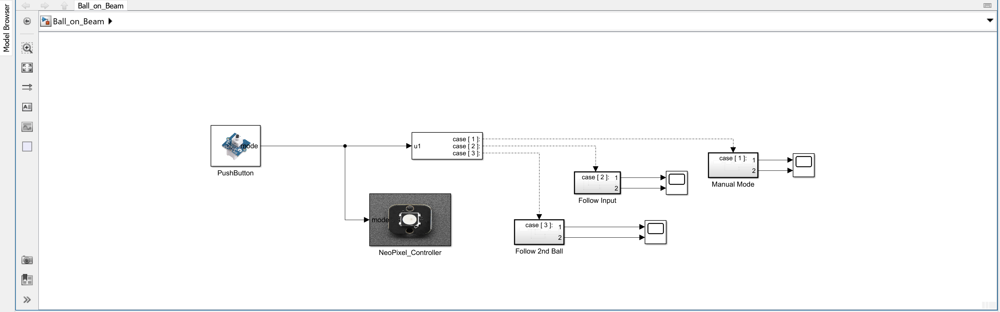

# X. Show Mode

In this final task, you will combine all previously developed components into one integrated model. This "Show Mode" is designed for demonstration purposes and allows you to showcase all hardware features and control modes of the Ball-on-Beam system.

---

## 1. Integrate All Together

Ensure your Simulink model includes all necessary components from previous tasks. This includes:

- **Beam SoftPot**: Reads the current ball position.
- **Control SoftPot**: Provides real-time target position (setpoint).
- **Servo Controller**: Controls beam angle based on the selected mode.
- **PID Controller**: Performs closed-loop control in automatic mode.
- **Rotary Knob**: Allows manual beam control in manual mode.
- **Pushbutton**: Toggles between system modes.
- **NeoPixel LEDs**: Provide live visual feedback on active mode.

> All subsystems should now work seamlessly together. Mode switching, signal routing, and feedback must be reliable and robust.

---

## 2. Final Model Architecture

The final Simulink model includes:

- A **mode selector logic** that determines:
  - Whether the PID controller is active.
  - Which signal is used as the setpoint.
  - Whether manual beam control is enabled.
- A **multiplexer** for switching between control signals.
- Clear signal routing and groupings for readability.

Overview of the full system architecture in Show Mode

---

## 3. Demonstration Workflow

Follow these steps for a smooth demonstration:

1. Turn on the system and deploy the model using `Monitor & Tune`.
2. Observe LED feedback for the currently active mode.
3. Place the ball at a random starting position on the beam.
4. Use the pushbutton to cycle through modes:
   - In **Rotary Mode**, manually stabilize the ball.
   - In **Control SoftPot Mode**, place the second ball to define a setpoint.
   - In **Simulink Mode**, demonstrate tracking of a generated sine wave or step response.
5. Highlight how the system autonomously moves and stabilizes the ball.

> Ensure the beam is level and all sensors are securely connected before running the demo.

---

## 4. Safety Checks

Before and during the demo:

- Check that the servo moves smoothly and silently.
- Ensure no cables obstruct the moving parts.
- Avoid quick or extreme setpoint changes that might cause the ball to jump.

---

## 5. Summary

| Feature              | Demonstrated Element                                  |
|----------------------|--------------------------------------------------------|
| Sensor Feedback      | Ball position and setpoint via SoftPot sensors         |
| User Interaction     | Pushbutton for mode switching                          |
| Visual Feedback      | NeoPixel LED mode indication                           |
| Control Performance  | PID-regulated stabilization and tracking               |
| Manual Override      | Direct beam control with rotary knob                   |

You have now completed the full integration of the Ball-on-Beam system.  
The platform is ready for presentation, testing, and real-world exploration.
